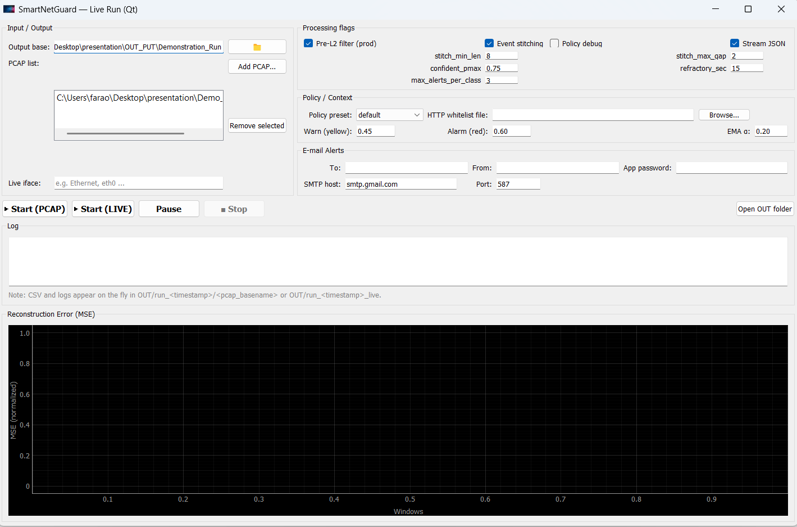
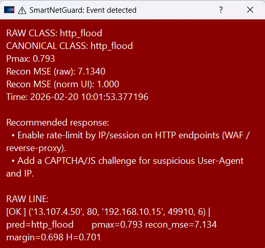
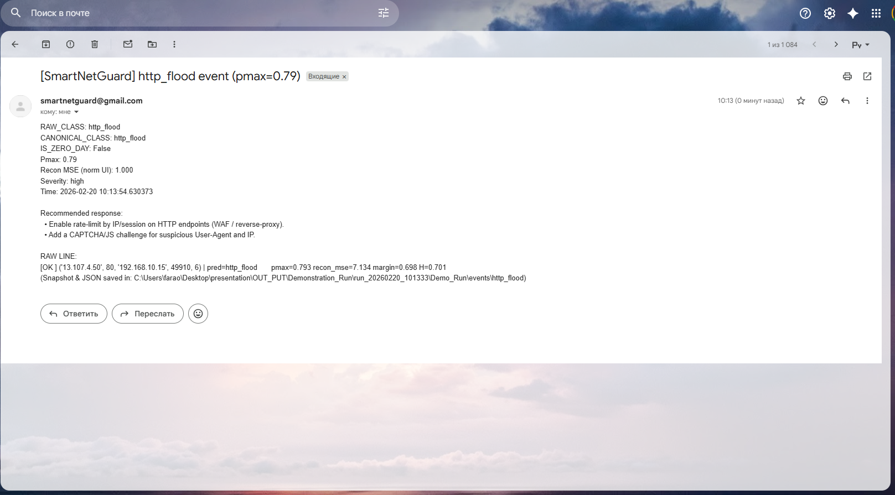
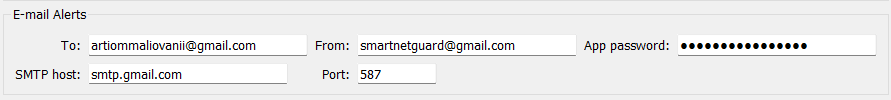
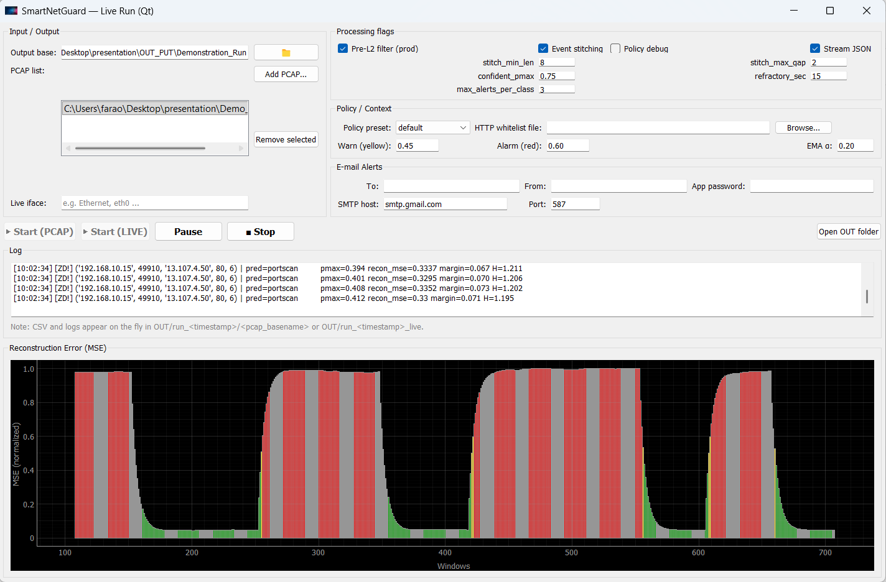

# 🚀 SmartNetGuard — Quick Demo 

SmartNetGuard is an AI-based system that analyzes network traffic (PCAP files) 
and detects cyber attacks in real-time.

It combines:
- L1 anomaly detection (AutoEncoder)
- L2 classification (Conv1D model)
- Policy engine (Zero-Day + confidence logic)
- Real-time GUI + Email alerts

---

## 🖥 Live GUI

Real-time monitoring of network activity and anomaly score (MSE):



---

## 🚨 Attack detection example

When an attack is detected:

- Classification (e.g. HTTP Flood)
- Confidence score (pmax)
- Reconstruction error (MSE)
- Recommended mitigation actions



---

## 📧 Email alerts

The system can send automatic alerts to a SOC analyst:

- Attack type
- Severity
- Confidence
- Suggested response



---

## ⚙️ Alert configuration (SMTP)

Supports sending alerts via email (Gmail SMTP):



---

## 📊 Model performance

Example evaluation metrics:



---

## ⚙️ How to run

```bash
pip install -r requirements.txt
python SmartNetGuard_GUI.py
Then:

Load PCAP file

Press "Start"

Observe detections in real-time
